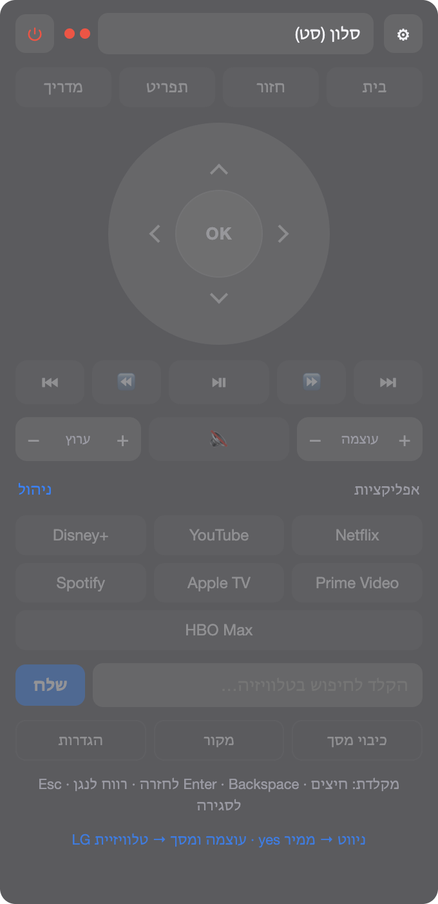

<div align="center">

# שלט טלוויזיה

**שלט לממירי Android TV ולטלוויזיות חכמות — למחשב ולנייד.**
הכל רץ ברשת הביתית. בלי ענן, בלי חשבון, בלי שרת באמצע.



</div>

---

## מה זה עושה

מחליף את אפליקציית השלט בטלפון, ומוסיף שני דברים שהיא לא עושה: הוא מחבר
**מסך וממיר לשלט אחד**, והוא **לומד** אילו אפליקציות מותקנות בממיר.

| מכשיר | פרוטוקול | פורטים | צימוד |
| --- | --- | --- | --- |
| ממיר Android TV / Google TV | Android TV Remote v2 — protobuf מעל TLS דו־כיווני | 6466, 6467 | קוד בן 6 תווים על המסך |
| טלוויזיית LG (webOS) | SSAP מעל WebSocket | 3000, 3001 | אישור על המסך |
| טלוויזיית Samsung (Tizen 2016+) | JSON מעל WebSocket | 8002 | אישור על המסך |

טלוויזיה ישנה בלי חיבור רשת עדיין נשלטת — דרך הממיר המחובר אליה בכבל HDMI,
בתקן CEC.

## שלוש החלטות שמסבירות את הקוד

**סט = מסך + ממיר, ושלט אחד לשניהם.** כל פקודה מנותבת למכשיר שאמור לטפל בה:
ניווט ומדיה לממיר, עוצמה ובחירת מקור למסך, וכפתור ההפעלה לשניהם יחד. הניתוב
אינו נוקשה — אם המכשיר המועדף חסר, מנותק, או לא מצהיר על תמיכה בפקודה, היא
נשלחת לשני. זה בדיוק מה שגורם לעוצמת השמע לעבוד מול טלוויזיה בלי שליטה
ברשת: הממיר מעביר את המקשים ב-CEC.

**רשימת האפליקציות נבנית אחרת בכל פלטפורמה, כי היכולות שונות.** LG וסמסונג
מדווחות מה מותקן, אז הרשימה חיה. ל-Android TV אין דרך: הפרוטוקול מכיל הודעה
אחת בלבד לאפליקציות — `RemoteAppLinkLaunchRequest{ app_link }` — ואין בו בקשה
למנות. לכן הממיר **לומד** מהאירוע `current_app`, שהוא כן משדר בכל החלפה: פתח
אפליקציה עם השלט הרגיל והיא תופיע כהצעה לשמירה.

**מקור אמת אחד לשני הלקוחות.** `shared/keys.json` ו-`shared/apps.json` מחזיקים
את מיפוי המקשים ואת הקטלוג. שני הלקוחות מעתיקים אותם פנימה בזמן בנייה, ולכן
מיפוי לא יכול להיווצר שונה בין הפלטפורמות.

## מבנה

```
desktop/     אפליקציית שורת־תפריטים ל-macOS (Electron)
mobile/      אפליקציית Android (Flutter; תיקיית iOS מוכנה לעתיד)
shared/      מיפוי מקשים וקטלוג אפליקציות — נצרב לשני הלקוחות
tools/       סקריפטים תפעוליים
docs/        מדריכים
```

## התחלה מהירה

```sh
# macOS
cd desktop && npm install && npm start

# Android
cd mobile && flutter pub get && flutter run
```

בהפעלה הראשונה החלון נפתח בהגדרות: **חפש מכשירים** ← הוסף ← צמד. אם טלוויזיה
הייתה כבויה בזמן החיפוש היא לא שידרה את עצמה — הדלק וסמן **סריקה עמוקה**.

כל ההסברים נמצאים גם **בתוך האפליקציה** (הגדרות ← **?**): צימוד, ניתוב בסט,
CEC, והדלקה מרחוק. הקבצים כאן הם עותק, לא המקור.

## מדריכים

| | |
| --- | --- |
| [docs/SIGNING.md](docs/SIGNING.md) | מפתח החתימה: יצירה, גיבוי, אימות, ומה קורה אם הוא אובד |
| [docs/RELEASING.md](docs/RELEASING.md) | חיתוך גרסה ושחרור אוטומטי בתגית |
| [docs/DISTRIBUTION.md](docs/DISTRIBUTION.md) | הפצה בלי חנות, וחשבון ההפצה המוגבלת החינמי |
| [docs/ICONS.md](docs/ICONS.md) | מה לייצר, פרומפטים ל-AI, והאילוץ של Adaptive Icon |

## פיתוח

```sh
cd desktop
npm run check        # מאמת שכל פקודה שהניתוב מפנה אליה קיימת בטבלאות
npm run discover     # בדיקת גילוי מכשירים משורת הפקודה
npm run smoke <ip>   # בדיקת פרוטוקול ישירה מול ממיר

TV_REMOTE_DEV=1 npm start   # פותח את החלון מיד, עם DevTools ולוג שגיאות
```

`TV_REMOTE_SHOT=<path>` מרנדר את החלון ל-PNG ויוצא, ו-`TV_REMOTE_SHOT_JS` מריץ
JS בדף לפני הצילום — כך אפשר לצלם כל מסך בלי הרשאת הקלטת מסך.

> **שים לב:** VS Code מייצא `ELECTRON_RUN_AS_NODE=1`, שגורם לכל בינארי Electron
> לרוץ כ-Node רגיל, בלי `app` ובלי חלון. סקריפט ה-`start` מנקה את המשתנה; אם
> תריץ `electron` ידנית מטרמינל של VS Code תיתקל בזה.

## תודות

הפרוטוקול של Android TV Remote v2 פוענח במקור על ידי
[louis49/androidtv-remote](https://github.com/louis49/androidtv-remote).
הלקוח כאן משתמש ב-[@kud/androidtv-remote](https://github.com/kud/androidtv-remote),
כתיבה מחדש ב-TypeScript, וב-[lgtv2](https://github.com/hobbyquaker/lgtv2) ל-webOS.

## רישיון

MIT
